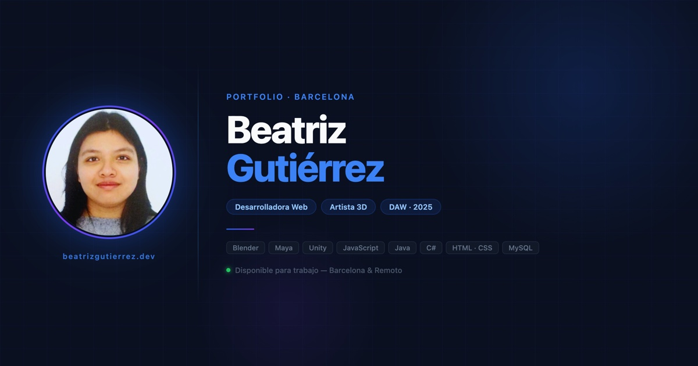

# Beatriz Gutiérrez — Portfolio Profesional

> Portfolio personal de **Beatriz Gutiérrez**, Desarrolladora Web (DAW) y Artista 3D especializada en Blender, Maya y Unity. Disponible para trabajo en Barcelona y remoto.

🌐 **[beatrizgutierrez.netlify.app](https://beatrizgutierrez.netlify.app)**



---

## Índice

- [Descripción](#descripción)
- [Tech Stack](#tech-stack)
- [Características](#características)
- [Estructura del proyecto](#estructura-del-proyecto)
- [Inicio rápido](#inicio-rápido)
- [SEO y visibilidad](#seo-y-visibilidad)
- [Despliegue](#despliegue)
- [Contacto](#contacto)

---

## Descripción

Portfolio profesional construido con **React 19 + Vite 7 + TypeScript**, diseñado con enfoque **mobile-first** y tema oscuro. Incluye secciones de presentación, habilidades, portfolio 3D (ArtStation), experiencia laboral, formación académica y contacto.

Optimizado para **SEO clásico** (Google) y **SEO semántico para IA** (Google AI Overviews, Perplexity, ChatGPT Search) mediante structured data (JSON-LD), FAQPage schema y el estándar `llms.txt`.

---

## Tech Stack

| Categoría | Tecnología |
|-----------|------------|
| Framework | React 19 + TypeScript |
| Bundler | Vite 7 |
| Estilos | Tailwind CSS v4 |
| Animaciones | Framer Motion v12 |
| Iconos | Lucide React |
| i18n | Context API custom (ES / EN) |
| Deploy | Netlify |

---

## Características

- **Bilingüe** — toggle instantáneo Español / English sin recarga
- **Dark theme** por defecto, paleta `slate-900` con acentos `blue-500`
- **Mobile-first** — auditado a 390×844px (iPhone 14 Pro)
- **Animaciones** con Framer Motion (`whileInView`, staggered delays)
- **Descarga de CV** directo desde el Hero
- **FAQ interactivo** con acordeón animado + microdata Schema.org
- **SEO completo**: Open Graph, Twitter Card, JSON-LD, canonical, sitemap, robots.txt
- **llms.txt** — perfil legible por motores de IA (Perplexity, ChatGPT, Claude)

---

## Estructura del proyecto

```
portfolio/
├── public/
│   ├── avatar.png            # Foto de perfil
│   ├── og-image.jpg          # Preview para redes sociales (1200×630)
│   ├── favicon.svg           # Favicon SVG con gradiente BG
│   ├── apple-touch-icon.png
│   ├── icon-512.png
│   ├── bea_curri.pdf         # CV descargable
│   ├── robots.txt
│   ├── sitemap.xml
│   └── llms.txt              # Para rastreadores de IA
├── src/
│   ├── components/
│   │   ├── Navbar.tsx
│   │   ├── Hero.tsx
│   │   ├── About.tsx
│   │   ├── Skills.tsx
│   │   ├── Portfolio.tsx
│   │   ├── Experience.tsx
│   │   ├── Education.tsx
│   │   ├── FAQ.tsx
│   │   ├── Contact.tsx
│   │   └── Footer.tsx
│   ├── context/
│   │   └── LangContext.tsx   # Proveedor ES/EN
│   ├── i18n/
│   │   └── translations.ts   # Textos ES + EN
│   ├── App.tsx
│   ├── main.tsx
│   └── index.css
└── index.html                # SEO: OG, JSON-LD, FAQPage schema
```

---

## Inicio rápido

```bash
# Clonar el repositorio
git clone https://github.com/Beaguti248/portfolio.git
cd portfolio

# Instalar dependencias
npm install

# Servidor de desarrollo
npm run dev

# Build de producción
npm run build

# Preview del build
npm run preview
```

**Requisitos:** Node.js 18+

---

## SEO y visibilidad

### Structured Data (JSON-LD)
- `Person` con `hasCredential`, `hasOccupation`, `knowsAbout`, `seeks`
- `ProfilePage` con `Speakable` (para Google Assistant y búsqueda por voz)
- `WebSite`
- `FAQPage` — 5 preguntas optimizadas para Google AI Overviews y "People Also Ask"

### robots.txt
Permite explícitamente rastreadores de IA: `GPTBot`, `PerplexityBot`, `ClaudeBot`, `anthropic-ai`, `Google-Extended`, `FacebookBot`, `Applebot`

### llms.txt
Perfil estructurado en texto plano para motores de búsqueda basados en LLMs, siguiendo el estándar 2025/2026.

---

## Despliegue

El sitio está desplegado en **Netlify** desde la carpeta `dist/`.

```bash
# Build y deploy manual
npm run build
netlify deploy --prod --dir=dist
```

---

## Contacto

| Canal | |
|-------|-|
| Email | [beaguti248@gmail.com](mailto:beaguti248@gmail.com) |
| GitHub | [github.com/Beaguti248](https://github.com/Beaguti248) |
| ArtStation | [artstation.com/crushhycrush24](https://www.artstation.com/crushhycrush24) |
| Web | [beatrizgutierrez.netlify.app](https://beatrizgutierrez.netlify.app) |

---

*Hecho con React + Vite · Barcelona, 2026*
